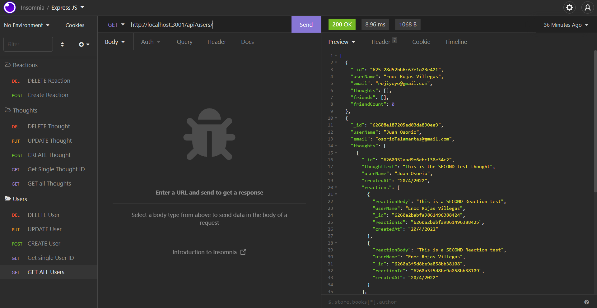

# Social Network API

## Description

- What was your motivation?  
  To begin using MongoDB and Mongoose

- Why did you build this project?  
  This activity is focused to practice modeling, routing but with the addition of Mongoose

- What problem does it solve?  
  It is and API where anyone can perform CRUD methodology, share thoughts and reactions based upon a user.

- What did you learn?  
  How to model, route and use controllers
   
- Briefly describe your Project:  
  This application lets the user perform CRUD methods to add a user and have thoughts and reactions individually added, everything through its main id.
   

## Table of Contents

- [Description](#description)
- [Installation](#installation)
- [Usage](#usage)
- [Contributors](#contributors)
- [Questions](#questions)
- [Video](#video)

## Installation

What are the steps required to install your project?

    Clone the repo, run "npm i"

## Usage

Provide instructions for use:

    After the above steps, run "npm start or npm run start"

## Contributors

Enoc Rojas Villegas

## Video

This is a brief explanation of how the app looks on Insomnia:
https://drive.google.com/file/d/1YngfeivtMDBhL2Pq_fVqcvVve5nxkvJS/view

## Questions

Check out my work as well!
Find me on GitHub: 
 (https://github.com/Enrique-Rojas-Villegas)  
Email me: 📧 rojiyoyo@gmail.com
